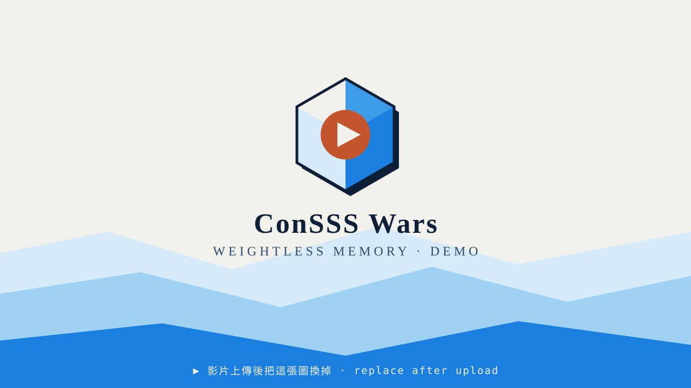

<div align="center">


# 鏈之英雄傳 ConSSS Wars

### 第 0 章 · 無重之憶 — Weightless Memory

**一分鐘打得完的回合制策略戰，對手是一個真的會讀盤的 AI agent。**<br>
打完的戰報會被寫成「記憶碎片」，存進 0G Storage、錨定到 0G Chain，而且能從鏈上讀回來重新驗證。

[](https://chainscan-galileo.0g.ai)
[](https://docs.0g.ai/developer-hub/building-on-0g/compute-network/overview)
[](https://docs.0g.ai/developer-hub/building-on-0g/storage/sdk)
[](https://pages.cloudflare.com)
[](#本機開發)

[**▶ 線上試玩**](https://web.conssswars.com) · [遊戲規則](#遊戲規則三十秒版) · [0G 技術對照表](#0g-技術對照表--哪一行程式碼用了什麼) · [部署](#部署到-cloudflare-pages)

</div>

---

## 🎬 Demo

<div align="center">

<!-- 影片錄好上傳 YouTube 後：把下面的 VIDEO_ID 換成實際影片 ID，
     並把 public/images/youtube-thumb.svg 換成 https://img.youtube.com/vi/VIDEO_ID/maxresdefault.jpg -->
<a href="https://youtu.be/VIDEO_ID">
  
</a>

<sub>▲ 影片還沒上傳。上傳後把 `VIDEO_ID` 換掉，縮圖同時換成 YouTube 官方縮圖即可。</sub>

</div>

---

## 這是什麼

三條「記憶迴廊」，七個回合，每回合兩點算力。你顧不了三條 —— **選哪條放掉就是勝負**。

對面那個「遺忘者」不是寫死的 AI：每回合把整個盤面送給一個大型語言模型，它讀完盤、
挑好要出的牌、還會回一句嘲諷。打完之後，這場戰鬥的完整紀錄（含 AI 每回合出了什麼、說了什麼）
會被 0G Compute 上的另一個 agent 寫成一段檔案敘述，封成「記憶碎片」，
存進 0G Storage，摘要錨定到 0G Chain —— 然後**再從鏈上讀回來比對一次**。

> 這一段是重點：按了按鈕、錢包沒跳錯，不代表資料真的在鏈上。
> 所以結果畫面有一顆「鏈上回驗」按鈕，會實際去讀那筆交易的 calldata，
> 重新解析、跟本地碎片的 SHA-256 比對，比對相符才敢標成 ✓。

美術與音樂全部是程式現畫、現合成的 —— 沒有任何圖檔、沒有任何音檔。
`art.js` 是 inline SVG，`audio.js` 是程序化 WebAudio。

---

## 0G 技術對照表 · 哪一行程式碼用了什麼

三條賽道**都是實際會跑的程式碼路徑**，不是只在文件上寫有接。
下表每一列都直接連到 GitHub 上那幾行。

| # | 0G 技術 | 在遊戲裡做什麼 | 程式碼位置（點進去看行號） | 狀態 |
|---|---|---|---|---|
| **1** | **0G Compute Network**<br>（TEE 可驗證推論） | 戰後旁白 agent「記憶編纂者」：把整場戰鬥寫成要永久存檔的敘述。走 0G Router 的 OpenAI 相容端點。 | [`functions/api/narrate.js#L73-L127`](https://github.com/ConsssLab/web/blob/claude/0g-tech-competition-deploy-lv08or/functions/api/narrate.js#L73-L127) | ✅ 已實作 |
| **1** | **0G Compute Network**<br>（Router 端點常數） | Router base URL 與模型設定，敵方 agent 與旁白 agent 共用同一份設定工廠。 | [`functions/api/og/_shared.js#L23`](https://github.com/ConsssLab/web/blob/claude/0g-tech-competition-deploy-lv08or/functions/api/og/_shared.js#L23) · [`#L83-L90`](https://github.com/ConsssLab/web/blob/claude/0g-tech-competition-deploy-lv08or/functions/api/og/_shared.js#L83-L90) | ✅ 已實作 |
| **1** | **0G Compute Network**<br>（敵方 agent 可切換） | 敵方 AI agent 預設走 OpenAI；把 `AI_PROVIDER` 改成 `0g` 就整支切到 0G Compute，程式碼一行都不用動。 | [`functions/api/agent.js#L16`](https://github.com/ConsssLab/web/blob/claude/0g-tech-competition-deploy-lv08or/functions/api/agent.js#L16) · [`#L31-L40`](https://github.com/ConsssLab/web/blob/claude/0g-tech-competition-deploy-lv08or/functions/api/agent.js#L31-L40) | ✅ 已實作 |
| **2** | **0G Storage**<br>（寫入） | 記憶碎片正規化 → SHA-256 → 送進 0G Storage gateway，解析回傳的 merkle `root` 與 `txSeq`。 | [`functions/api/og/shard.js#L94-L160`](https://github.com/ConsssLab/web/blob/claude/0g-tech-competition-deploy-lv08or/functions/api/og/shard.js#L94-L160) | ✅ 已實作<br>（需設 gateway） |
| **2** | **0G Storage**<br>（唯讀查詢 / indexer） | 拿 root hash 打 Turbo indexer 的 `/file/info/{root}`，確認檔案真的被 storage node 收下並 finalized。唯讀，不需要金鑰。 | [`functions/api/og/storage.js#L54-L92`](https://github.com/ConsssLab/web/blob/claude/0g-tech-competition-deploy-lv08or/functions/api/og/storage.js#L54-L92) | ✅ 已實作 |
| **2** | **0G Storage**<br>（節點活性） | `indexer_getNodes` 探測 indexer 活性與節點數，畫成結果畫面的燈號。 | [`functions/api/og/status.js#L15-L33`](https://github.com/ConsssLab/web/blob/claude/0g-tech-competition-deploy-lv08or/functions/api/og/status.js#L15-L33) | ✅ 已實作 |
| **3** | **0G Chain**<br>（錨定寫入） | 組出 40 bytes 結構化 calldata（魔術字 `CSSW` + 版本 + 戰績 + SHA-256），由玩家自己的錢包送出。伺服器不保管任何私鑰。 | [`functions/api/og/shard.js#L74-L83`](https://github.com/ConsssLab/web/blob/claude/0g-tech-competition-deploy-lv08or/functions/api/og/shard.js#L74-L83) · [`public/js/og.js#L123-L137`](https://github.com/ConsssLab/web/blob/claude/0g-tech-competition-deploy-lv08or/public/js/og.js#L123-L137) | ✅ 已實作 |
| **3** | **0G Chain**<br>（鏈上回驗） | 用 `eth_getTransactionByHash` 把交易讀回來，反解 calldata，跟本地摘要比對，回報區塊高度、確認數、成功與否。 | [`functions/api/og/verify.js#L20-L37`](https://github.com/ConsssLab/web/blob/claude/0g-tech-competition-deploy-lv08or/functions/api/og/verify.js#L20-L37) · [`#L44-L92`](https://github.com/ConsssLab/web/blob/claude/0g-tech-competition-deploy-lv08or/functions/api/og/verify.js#L44-L92) | ✅ 已實作 |
| **3** | **0G Chain**<br>（鏈況 / 切鏈） | 標題頁即時顯示 Galileo 區塊高度與 gas price；錢包沒有這條鏈就自動 `wallet_addEthereumChain` 加進去。 | [`functions/api/og/status.js#L95-L112`](https://github.com/ConsssLab/web/blob/claude/0g-tech-competition-deploy-lv08or/functions/api/og/status.js#L95-L112) · [`public/js/og.js#L94-L116`](https://github.com/ConsssLab/web/blob/claude/0g-tech-competition-deploy-lv08or/public/js/og.js#L94-L116) | ✅ 已實作 |
| — | **敵方 AI agent**<br>（OpenAI API） | 每回合把盤面送給 `gpt-4o-mini`，收回出牌決策與嘲諷。輸出一律當不可信資料重新過濾。 | [`functions/api/agent.js#L206-L250`](https://github.com/ConsssLab/web/blob/claude/0g-tech-competition-deploy-lv08or/functions/api/agent.js#L206-L250) · [`public/js/ai.js#L20-L64`](https://github.com/ConsssLab/web/blob/claude/0g-tech-competition-deploy-lv08or/public/js/ai.js#L20-L64) | ✅ 已實作 |

**三條賽道是串起來的，不是三個各自獨立的 demo：**

```
賽道一 0G Compute ──寫出敘述──▶ 記憶碎片 ──存檔──▶ 賽道二 0G Storage
                                     │
                                  SHA-256
                                     ▼
                            賽道三 0G Chain 錨定 ──讀回來比對──▶ ✓
```

### 評審可以自己打的端點

部署好之後這幾支都是公開唯讀的，不需要任何金鑰：

```bash
# 三條賽道現在各自的狀態（照實回報，沒接上就寫沒接上）
curl https://web.conssswars.com/api/og/status | jq

# 賽道二：indexer 活性與節點數
curl https://web.conssswars.com/api/og/storage | jq

# 賽道三：拿任何一筆錨定交易的 hash 回來重驗
curl "https://web.conssswars.com/api/og/verify?tx=0x<你的交易hash>" | jq
```

---

## 遊戲規則（三十秒版）

- 三條「記憶迴廊」，每條 3 格。你在左、遺忘者在右。
- 每回合 **2 點算力** —— 顧不了三條，**選哪條放掉就是勝負**。
- 交戰**之前**先比火力：一條迴廊誰的攻擊力總和高，就啃對方核心 **2 點**。
  單位當回合陣亡也算數，所以「投入多少」比「殺幾隻」重要。
- 貼身或迎面撞上的單位互砍；打贏還活著的會乘勝追擊繼續前進。
- 走出邊界的單位直接打核心。核心 12 點，共 7 回合，先歸零的一方輸。

雙方牌組**刻意不對稱**：英雄方打得重，遺忘者比較耐打。數值完全鏡像的話，
雙方每回合互相抵銷，火力永遠打平，整局零傷害收在和局。

[`public/js/rules.js`](public/js/rules.js) 是純規則層（無 DOM、無網路），可以直接 import 跑對戰模擬：

```bash
npm run sim     # 跑 300 場隨機對戰，印出勝負分布與平均回合數
```

> ⚠️ **改任何數值前請先重跑模擬。** 現行數值是調出來的：
> 合理玩法約第 6 回合收掉，亂打約七成會輸（實測 300 場：71% 落敗，平均 3.7 回合）。

---

## 角色

| 角色 | 稱號 | English |
| --- | --- | --- |
| 零 Zero | 零界守望者 | Watcher of the Void |
| 蕙 Hue | 見證者 | The Witness |
| 刃 Ren | 零重刃 | Blade of Gravity |

形象照放 `public/images/heroes.png`（三格拼版，左到右 零→蕙→刃）就會自動採用；
沒放則退回 `art.js` 現畫的 inline SVG，兩種情況都能正常運作。

---

## 部署到 Cloudflare Pages

這個 repo 就是網站本體，**沒有建置步驟**：`public/` 直接是成品，
`functions/` 會被 Cloudflare 自動辨識成 Pages Functions。

### 方式 A · Dashboard 連 Git（推薦，設定一次就好）

Dashboard → **Workers & Pages** → **Create** → **Pages** → **Connect to Git** → 選 `ConsssLab/web`。

| 欄位 | 填入的值 |
| --- | --- |
| 專案名稱 | `conssswars-web` |
| Production branch | `main` |
| Framework preset | `None` |
| Build command | **留空** |
| Build output directory | `public` |
| Root directory | **留空** |

### 方式 B · 從本機一行推上去

```bash
npx wrangler login
npx wrangler pages deploy public --project-name conssswars-web
```

### 方式 C · GitHub Actions（推 main 就自動部署）

[`.github/workflows/deploy.yml`](.github/workflows/deploy.yml) 已經寫好。
在 repo → Settings → Secrets and variables → Actions 補兩個 secret 就會生效：

| Secret | 從哪裡拿 |
| --- | --- |
| `CLOUDFLARE_API_TOKEN` | My Profile → API Tokens，權限選 **Account → Cloudflare Pages → Edit** |
| `CLOUDFLARE_ACCOUNT_ID` | Dashboard 右側欄可直接複製 |

> A 和 C 擇一即可，兩個都開會讓同一個 commit 部署兩次。

### 綁定 web.conssswars.com

專案 → **Custom domains** → **Set up a custom domain** → 輸入 `web.conssswars.com`。

`conssswars.com` 的 DNS 需要在 Cloudflare 上管理，Cloudflare 才會自動建記錄並簽憑證。
只加 `web` 這個子網域，apex 與 `play` 的既有記錄完全不動。

> ⚠️ 自訂網域要加在**這個新專案**裡。加到別的 Pages 專案上，那個專案的內容就會出現在 `web.conssswars.com`。

---

## 環境變數

**Settings → Variables and Secrets**，Production 與 Preview 都要設。
API 金鑰請選 **Secret**（加密），不要用一般變數。

| 變數 | 賽道 | 必要性 | 說明 |
| --- | --- | --- | --- |
| `OPENAI_API_KEY` | 敵方 agent | 建議設 | OpenAI 金鑰。**只存在 Function 端**，不會進前端 bundle。 |
| `OPENAI_MODEL` | 敵方 agent | 選用 | 預設 `gpt-4o-mini` |
| `AI_PROVIDER` | 敵方 agent | 選用 | `openai`（預設）或 `0g`（敵方 agent 也切到 0G Compute） |
| `OG_COMPUTE_API_KEY` | 賽道一 | 建議設 | 0G Compute Router 金鑰，從 [pc.0g.ai](https://pc.0g.ai) 取得 |
| `OG_COMPUTE_MODEL` | 賽道一 | 選用 | 預設 `deepseek-chat-v3-0324` |
| `OG_STORAGE_INDEXER` | 賽道二 | 選用 | 預設 Turbo indexer；唯讀查詢不需金鑰 |
| `OG_STORAGE_UPLOAD_URL` | 賽道二 | 上傳才需要 | 指向 `0g-storage-client` gateway；沒設就只產生摘要 |
| `OG_STORAGE_TOKEN` | 賽道二 | 選用 | 上述 gateway 需要的 Bearer token |
| `OG_RPC_URL` | 賽道三 | 選用 | 預設 `https://evmrpc-testnet.0g.ai` |

**一個金鑰都沒設也能玩** —— AI agent 退到本地啟發式對手，畫面上照實標示
「本地備援（未接上模型）」，不會假裝有接。

---

## 本機開發

```bash
git clone https://github.com/ConsssLab/web.git && cd web
npm install

# 把 OpenAI 金鑰寫進 .env（互動輸入，不會留在 shell 記錄裡）
bash scripts/set-key.sh OPENAI_API_KEY

npm run dev          # http://127.0.0.1:8788，含 /api/* Functions
```

只想看前端、不需要 `/api/*` 的話，任何靜態伺服器都能開：

```bash
cd public && python3 -m http.server 8788
```

---

## 檔案配置

```
public/                     建置輸出目錄（直接就是成品，無建置步驟）
├─ index.html               五個畫面：標題 / 劇情 / 簡報 / 戰鬥 / 結果
├─ images/                  logo、demo 縮圖、角色形象照
├─ css/style.css            紙白平塗風，iPhone 直式 390×844 為基準
└─ js/
   ├─ rules.js              純規則層，無 DOM 無網路，可直接跑對戰模擬
   ├─ story.js              劇情腳本、角色資料與結局文案
   ├─ art.js                全部美術（inline SVG，現畫，無圖檔）
   ├─ audio.js              程序化 BGM 與音效（WebAudio，無音檔）
   ├─ ai.js                 敵方 AI agent 前端客戶端 + 離線備援
   ├─ og.js                 0G 前端整合：錢包、切鏈、錨定、回驗、Storage 查詢
   └─ main.js               主流程、動畫節奏、0G 三賽道狀態面板

functions/api/
├─ agent.js                 敵方 AI agent 大腦（OpenAI，唯一持有該金鑰的地方）
├─ narrate.js               賽道一：0G Compute 上的旁白 agent
└─ og/
   ├─ _shared.js            三支共用的網路常數與 JSON-RPC
   ├─ status.js             三賽道即時狀態
   ├─ shard.js              賽道二寫入 + 賽道三 calldata 組裝
   ├─ storage.js            賽道二唯讀查詢（indexer）
   └─ verify.js             賽道三鏈上回驗

scripts/
├─ set-key.sh               互動式寫入 .env 的金鑰
└─ simulate.mjs             對戰模擬，改數值前先跑這個
```

---

## 安全性

- **API 金鑰只存在 Function 端。** 前端拿不到，也不會出現在 bundle 裡。
- **不保管任何私鑰。** 上鏈那步走玩家自己的錢包；0G Storage 的寫入交給外部 gateway，
  Worker 裡沒有私鑰可偷。
- **模型輸出一律當成不可信資料。** 只取白名單欄位、比對合法手牌清單、夾在算力預算內
  ——[`sanitizePlays()`](functions/api/agent.js)，前端 `rules.js` 還會再 validate 一次。
  台詞用 `textContent` 進 DOM，不走 `innerHTML`。
- **要上鏈的資料在 Function 端重新正規化**，前端塞不進任意內容。

---

<div align="center">

測試網 gas 到 [faucet.0g.ai](https://faucet.0g.ai) 領 · 交易在 [chainscan-galileo.0g.ai](https://chainscan-galileo.0g.ai) 查

**ConSSS Lab** · 0G Hackathon 參賽作品

</div>
