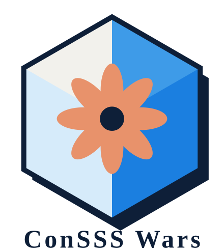

<div align="center">



# 鏈州英雄傳 ConSSS Wars

### 第 0 章 · 無重之憶 — Weightless Memory

**一分鐘打得完的回合制策略戰，對手是一個真的會讀盤的 AI agent。**<br>
打完的戰報會被寫成「記憶碎片」，存進 0G Storage、錨定到 0G Chain，而且能從鏈上讀回來重新驗證。

[](https://chainscan-galileo.0g.ai)
[](https://docs.0g.ai/developer-hub/building-on-0g/compute-network/overview)
[](https://docs.0g.ai/developer-hub/building-on-0g/storage/sdk)
[](https://pages.cloudflare.com)
[](#本機開發)

[**▶ 線上試玩**](https://conssswars-web.pages.dev) · [**看 Demo 影片**](https://youtube.com/shorts/PV0HpkiGv24) · [給評審看這裡](#給評審--三十秒看完-0g-用在哪) · [遊戲規則](#遊戲規則三十秒版) · [部署](#部署到-cloudflare-pages)

</div>

---

## 🎬 Demo

<div align="center">

<a href="https://youtube.com/shorts/PV0HpkiGv24">
  
</a>

**[▶ 看 Demo 影片](https://youtube.com/shorts/PV0HpkiGv24)**

</div>

---

## 給評審 · 三十秒看完 0G 用在哪

一場戰鬥的資料被三條賽道**接力**處理，不是三個各自獨立的 demo：

```
0G Compute 的 TEE agent 寫出戰報敘述
        ↓  （這份敘述被封進記憶碎片）
記憶碎片 ──算 merkle root、玩家錢包付費──▶ 真的存進 0G Storage
        ↓  （碎片的 SHA-256）
摘要 ──合約建立交易──▶ 錨定到 0G Chain ──讀回來逐欄比對──▶ ✓
```

**三條賽道都已在 Galileo 測試網跑通**，下面是其中一場的實際紀錄（可自行到瀏覽器重現）：

| 賽道 | 狀態 | 實測證據 |
|---|---|---|
| **0G Compute** | ✅ 通 | `deepseek-chat-v3-0324 · TEE 就緒`，戰後旁白由 enclave 產生 |
| **0G Storage** | ✅ 通 | 檔案 root `0x31dbf57395ca6d1b8f401f944453b846ce0c2a0cedddd97c27c4bc8a84d7cb25`<br>Flow 合約 submit tx `0x9c7377b88930c28412c95dfb452793c500233531264e09fef8537b91358b2218`<br>儲存費 92200934886 neuron，節點回報 `Single file upload completed` |
| **0G Chain** | ✅ 通 | 區塊 `#54068232`、5 個確認，calldata 讀回後**四項全部相符**（摘要 / 勝負 / 回合數 / 記憶核心） |

> 賽道二繞了很久才通。0G 的 storage node 是**裸 IP + 明文 http + 5678 埠**，瀏覽器擋 mixed content、Cloudflare Workers 又擋裸 IP（`error 1003`）與非標準埠（`error 521`），所以節點轉發那一小段必須跑在 Node 上（[`proxy/`](proxy/)）。細節寫在 [proxy/README.md](proxy/README.md)。

| 用了哪些 0G 技術 | 為什麼要用它 | 在哪一行用到 |
|---|---|---|
| **0G Compute Network**<br>TEE 可驗證推論 | 戰報要永久存檔，寫它的那個 agent 就不能是黑箱。金鑰在 pc.0g.ai 選 **Private（TEE enclave）** 開的，推論實際跑在 enclave 裡，不是只呼叫一個 OpenAI 相容端點。 | [`functions/api/narrate.js#L55-L134`](https://github.com/ConsssLab/web/blob/main/functions/api/narrate.js#L55-L134) |
| **0G Compute Network**<br>Router 設定 | 敵方 agent 與旁白 agent 共用同一份供應商工廠，把 `AI_PROVIDER` 改成 `0g` 就能整支切過去，不用改程式碼。 | [`functions/api/og/_shared.js#L22-L23`](https://github.com/ConsssLab/web/blob/main/functions/api/og/_shared.js#L22-L23) · [`functions/api/og/_shared.js#L82-L90`](https://github.com/ConsssLab/web/blob/main/functions/api/og/_shared.js#L82-L90) |
| **0G Storage**<br>真實寫入 | 記憶碎片要「永久保存」就必須真的落地。用官方 SDK 走完整協議：切 256-byte chunk 算 merkle root → 對 Flow 合約送 submit（付儲存費）→ 把 segment 傳給 storage node。**全程用玩家自己的錢包簽，伺服器不持有私鑰。** | [`public/js/storage.js#L72-L116`](https://github.com/ConsssLab/web/blob/main/public/js/storage.js#L72-L116)<br>節點代理（Node）：[`proxy/api/index.js`](https://github.com/ConsssLab/web/blob/main/proxy/api/index.js) —— 節點是裸 IP + 非標準埠，Cloudflare Workers 打不到（error 1003 / 521），這一段必須跑在 Node 上 |
| **0G Storage**<br>indexer 唯讀查詢 | 「上傳沒報錯」不等於存進去了。拿 root hash 回頭問 indexer，確認 storage node 真的收下並 finalized 才敢標成已存檔。唯讀、不需金鑰，評審可自行查證。 | [`functions/api/og/storage.js#L117-L159`](https://github.com/ConsssLab/web/blob/main/functions/api/og/storage.js#L117-L159) |
| **0G Storage**<br>節點活性探測 | 結果畫面的燈號要照實反映網路狀態，不能寫死成綠燈。 | [`functions/api/og/status.js#L34-L57`](https://github.com/ConsssLab/web/blob/main/functions/api/og/status.js#L34-L57) |
| **0G Chain**<br>錨定寫入 | 戰報需要一個不可竄改、有時間戳的存在證明。40 bytes 結構化 calldata（魔術字 `CSSW` + 版本 + 戰績 + SHA-256），用合約建立交易送出，chainscan 上一眼認得出來。 | [`functions/api/og/shard.js#L62-L84`](https://github.com/ConsssLab/web/blob/main/functions/api/og/shard.js#L62-L84) · [`public/js/og.js#L235-L260`](https://github.com/ConsssLab/web/blob/main/public/js/og.js#L235-L260) |
| **0G Chain**<br>鏈上回驗 | **這是整個專案的重點**：按了按鈕、錢包沒報錯，不代表資料真的在鏈上。所以再用 `eth_getTransactionByHash` 把交易讀回來、反解 calldata、跟本地碎片逐欄比對，四項全對才打勾。 | [`functions/api/og/verify.js#L19-L47`](https://github.com/ConsssLab/web/blob/main/functions/api/og/verify.js#L19-L47) · [`functions/api/og/verify.js#L49-L104`](https://github.com/ConsssLab/web/blob/main/functions/api/og/verify.js#L49-L104) |
| **0G Chain**<br>鏈況與網路切換 | 標題頁即時顯示 Galileo 區塊高度；chainId **從鏈上實際讀回來**校準而不是寫死（0G 換過 chain ID 16601→16602，寫死會讓切鏈整個失敗）。 | [`functions/api/og/status.js#L59-L157`](https://github.com/ConsssLab/web/blob/main/functions/api/og/status.js#L59-L157) · [`public/js/og.js#L167-L220`](https://github.com/ConsssLab/web/blob/main/public/js/og.js#L167-L220) |
| — **敵方 AI agent**<br>（OpenAI，非 0G） | 對戰時每回合都要叫一次，需要低延遲，所以另外走 OpenAI。模型輸出一律當不可信資料重新過濾。 | [`functions/api/agent.js#L173-L256`](https://github.com/ConsssLab/web/blob/main/functions/api/agent.js#L173-L256) · [`public/js/ai.js#L16-L65`](https://github.com/ConsssLab/web/blob/main/public/js/ai.js#L16-L65) |

### 評審可以自己打的端點

全部公開唯讀，不需要任何金鑰：

```bash
# 三條賽道現在各自的狀態（照實回報，沒接上就寫沒接上）
curl https://conssswars-web.pages.dev/api/og/status | jq

# 賽道二：indexer 活性與節點數
curl https://conssswars-web.pages.dev/api/og/storage | jq

# 賽道二：拿 0G Storage root 查檔案在不在網路上
curl "https://conssswars-web.pages.dev/api/og/storage?root=0x<你的root>" | jq

# 賽道三：拿任何一筆錨定交易的 hash 回來重驗
curl "https://conssswars-web.pages.dev/api/og/verify?tx=0x<你的交易hash>" | jq
```

---

## 這是什麼

三條「記憶迴廊」，七個回合，每回合兩點算力。你顧不了三條 —— **選哪條放掉就是勝負**。

對面那個「遺忘者」不是寫死的 AI：每回合把整個盤面送給一個大型語言模型，它讀完盤、
挑好要出的牌、還會回一句嘲諷。打完之後，這場戰鬥的完整紀錄（含 AI 每回合出了什麼、說了什麼）
會被 0G Compute 上的另一個 agent 寫成一段檔案敘述，封成「記憶碎片」，
存進 0G Storage，摘要錨定到 0G Chain —— 然後**再從鏈上讀回來比對一次**。

> 這一段是重點：按了按鈕、錢包沒跳錯，不代表資料真的在鏈上。
> 所以結果畫面有一顆「鏈上回驗」按鈕，會實際去讀那筆交易的 calldata，
> 重新解析、跟本地碎片的 SHA-256 比對，比對相符才敢標成 ✓。

音樂與音效**沒有任何音檔** —— `audio.js` 是程序化 WebAudio，全部現合成。
美術除了三位主角的形象照（`public/images/heroes.jpeg`）之外，也全是 `art.js` 現畫的
inline SVG：戰場、卡牌、遺忘者的遮罩、結果畫面都沒有圖檔。把形象照抽掉照樣能玩，
角色卡會自動退回 SVG 版本。

---

## 遊戲規則（三十秒版）

- 三條「記憶迴廊」，每條 3 格。你在左、遺忘者在右。
- 每回合 **2 點算力** —— 顧不了三條，**選哪條放掉就是勝負**。
- 交戰**之前**先比火力：一條迴廊誰的攻擊力總和高，就啃對方核心 **2 點**。
  單位當回合陣亡也算數，所以「投入多少」比「殺幾隻」重要。
- 貼身或迎面撞上的單位互砍；打贏還活著的會乘勝追擊繼續前進。
- 走出邊界的單位直接打核心。核心 12 點，共 7 回合，先歸零的一方輸。

雙方牌組**刻意不對稱**：英雄方打得重，遺忘者比較耐打。數值完全鏡像的話，
雙方每回合互相抵銷，火力永遠打平，整局零傷害收在和局。

[`public/js/rules.js`](public/js/rules.js) 是純規則層（無 DOM、無網路），可以直接 import 跑對戰模擬：

```bash
npm run sim     # 跑 300 場隨機對戰，印出勝負分布與平均回合數
```

> ⚠️ **改任何數值前請先重跑模擬。** 現行數值是調出來的：合理玩法約第 6 回合收掉，
> 亂打大多會輸。模擬用的是隨機出牌，每次結果會抖動 —— 連跑五輪的實測範圍是
> **落敗 59–69%、平均 3.7–3.8 回合**（其餘多為和局，隨機亂打贏面約兩成）。

---

## 角色

| 角色 | 稱號 | English |
| --- | --- | --- |
| 零 Zero | 零界守望者 | Watcher of the Void |
| 蕙 Hue | 見證者 | The Witness |
| 刃 Ren | 零重刃 | Blade of Gravity |

形象照放 `public/images/heroes.{png,jpg,jpeg,webp}`（**一張**三格拼版，左到右 零→蕙→刃）
就會自動採用 —— 程式不裁圖，整張載入後用 CSS 取三等分之一。
現行那張是 **1361×768**，所以單格約 **454×768**；CSS 的 `aspect-ratio` 直接寫成
`1361 / 2304`（= 整張寬 ÷ 單格高×3），換圖時記得一起改，比例不對臉會被縱向拉伸。
沒放則退回 `art.js` 現畫的 inline SVG，兩種情況都能正常運作。細節見
[`public/images/README.md`](public/images/README.md)。

---

## 部署到 Cloudflare Pages

這個 repo 就是網站本體，**沒有建置步驟**：`public/` 直接是成品，
`functions/` 會被 Cloudflare 自動辨識成 Pages Functions。

### 方式 A · Dashboard 連 Git（推薦，設定一次就好）

Dashboard → **Workers & Pages** → **Create** → **Pages** → **Connect to Git** → 選 `ConsssLab/web`。

| 欄位 | 填入的值 |
| --- | --- |
| 專案名稱 | `conssswars-web` |
| Production branch | `main` |
| Framework preset | `None` |
| Build command | **留空** |
| Build output directory | `public` |
| Root directory | **留空** |

### 方式 B · 從本機一行推上去

```bash
npx wrangler login
npx wrangler pages deploy public --project-name conssswars-web --branch main
```

> `--branch main` 不能省 —— 少了它會部署成 Preview，只拿得到一個 hash 網址，
> 正式網址不會更新。

### 方式 C · GitHub Actions（推 main 就自動部署）

[`.github/workflows/deploy.yml`](.github/workflows/deploy.yml) 已經寫好。
在 repo → Settings → Secrets and variables → Actions 補兩個 secret 就會生效：

| Secret | 從哪裡拿 |
| --- | --- |
| `CLOUDFLARE_API_TOKEN` | My Profile → API Tokens，權限選 **Account → Cloudflare Pages → Edit** |
| `CLOUDFLARE_ACCOUNT_ID` | Dashboard 右側欄可直接複製 |

> A 和 C 擇一即可，兩個都開會讓同一個 commit 部署兩次。

### 賽道二還需要一台 Node 代理

**這一步不做的話，「存進 0G Storage」一定失敗。**

0G 的 storage node 是**裸 IP + 明文 http + 5678 埠**（實測 `http://34.19.125.196:5678`）。
Cloudflare Workers 兩樣都打不到 —— 對裸 IP 會回 `error 1003`，非標準埠會回 `error 521` ——
所以「把 segment 轉發給節點」這一小段必須跑在一般 Node 上。

```bash
cd proxy && npx vercel --prod          # 記下輸出的 Production 網址
cd .. && npx wrangler pages secret put OG_ZG_PROXY_BASE --project-name conssswars-web
# 貼上：https://<剛剛的網址>/api
```

其餘部分照舊留在 Cloudflare。前端不寫死代理網址 —— `/api/og/status` 會把
`OG_ZG_PROXY_BASE` 當成 `storage.zgProxy` 下發，換代理只要改這個變數。
完整說明在 [proxy/README.md](proxy/README.md)。

### 綁定 web.conssswars.com

專案 → **Custom domains** → **Set up a custom domain** → 輸入 `web.conssswars.com`。

`conssswars.com` 的 DNS 需要在 Cloudflare 上管理，Cloudflare 才會自動建記錄並簽憑證。
只加 `web` 這個子網域，apex 與 `play` 的既有記錄完全不動。

> ⚠️ 自訂網域要加在**這個新專案**裡。加到別的 Pages 專案上，那個專案的內容就會出現在 `web.conssswars.com`。

---

## 環境變數

**Settings → Variables and Secrets**，Production 與 Preview 都要設。
API 金鑰請選 **Secret**（加密），不要用一般變數。

| 變數 | 賽道 | 必要性 | 說明 |
| --- | --- | --- | --- |
| `OPENAI_API_KEY` | 敵方 agent | 建議設 | OpenAI 金鑰。**只存在 Function 端**，不會進前端 bundle。 |
| `OPENAI_MODEL` | 敵方 agent | 選用 | 預設 `gpt-4o-mini` |
| `AI_PROVIDER` | 敵方 agent | 選用 | `openai`（預設）或 `0g`（敵方 agent 也切到 0G Compute） |
| `OG_COMPUTE_API_KEY` | 賽道一 | 建議設 | 0G Compute Router 金鑰，從 [pc.0g.ai](https://pc.0g.ai) 取得 |
| `OG_COMPUTE_MODEL` | 賽道一 | 選用 | 預設 `deepseek-chat-v3-0324` |
| `OG_STORAGE_INDEXER` | 賽道二 | 選用 | 預設 Turbo indexer；唯讀查詢不需金鑰 |
| `OG_ZG_PROXY_BASE` | 賽道二 | **上傳必要** | 節點代理的網址（結尾要有 `/api`）。沒設的話前端會走同源的 `/api/og/zg`，那條路在 Cloudflare 上必定失敗 —— 見上面「賽道二還需要一台 Node 代理」 |
| `OG_PROXY_SECRET` | 賽道二 | 選用 | 代理用來簽節點網址的金鑰。擋的是「有人拿這個網域當跳板」，不是機密資料；沒設會用內建常數。要更嚴的話**主站與 proxy 兩邊要設成同一個值** |
| `OG_STORAGE_UPLOAD_URL` | 賽道二 | 選用 | 想讓玩家不用付儲存費才需要：指向自架的 `0g-storage-client` gateway，改由 Function 轉發上傳。預設是玩家用自己的錢包上傳，不需要設 |
| `OG_STORAGE_TOKEN` | 賽道二 | 選用 | 上述 gateway 需要的 Bearer token |
| `OG_RPC_URL` | 賽道三 | 選用 | 預設 `https://evmrpc-testnet.0g.ai` |

代理那台服務有自己的環境變數（`ALLOWED_ORIGINS`、`PUBLIC_BASE_URL` 等），
列在 [proxy/README.md](proxy/README.md)。

**一個金鑰都沒設也能玩** —— AI agent 退到本地啟發式對手，畫面上照實標示
「本地備援（未接上模型）」，不會假裝有接。

---

## 本機開發

```bash
git clone https://github.com/ConsssLab/web.git && cd web
npm install

# 把 OpenAI 金鑰寫進 .env（互動輸入，不會留在 shell 記錄裡）
bash scripts/set-key.sh OPENAI_API_KEY

npm run dev          # http://127.0.0.1:8788，含 /api/* Functions
```

只想看前端、不需要 `/api/*` 的話，任何靜態伺服器都能開：

```bash
cd public && python3 -m http.server 8788
```

---

## 檔案配置

```
public/                     建置輸出目錄（直接就是成品，無建置步驟）
├─ index.html               五個畫面：標題 / 劇情 / 簡報 / 戰鬥 / 結果
├─ 404.html                 找不到檔案時的真 404（沒有 SPA 後備，缺檔會現形）
├─ _headers                 快取與安全標頭；js/css 每次重新驗證
├─ _routes.json             哪些路徑交給 Pages Functions（/api/*）
├─ manifest.webmanifest     PWA 描述
├─ images/                  logo、角色形象拼版圖
├─ css/style.css            紙白平塗風，iPhone 直式 390×844 為基準
├─ vendor/                  釘死版本的第三方 bundle（0G Storage SDK、ethers），按下按鈕才載
└─ js/
   ├─ rules.js              純規則層，無 DOM 無網路，可直接跑對戰模擬
   ├─ story.js              劇情腳本、角色資料與結局文案
   ├─ art.js                全部美術（inline SVG，現畫）＋角色形象照切版
   ├─ audio.js              程序化 BGM 與音效（WebAudio，無音檔）
   ├─ ai.js                 敵方 AI agent 前端客戶端 + 離線備援
   ├─ og.js                 0G 前端整合：錢包、切鏈、錨定、回驗、Storage 查詢
   ├─ storage.js            賽道二：用玩家錢包跑官方 SDK 把碎片寫進 0G Storage
   └─ main.js               主流程、動畫節奏、0G 三賽道狀態面板

functions/api/              Cloudflare Pages Functions
├─ agent.js                 敵方 AI agent 大腦（OpenAI，唯一持有該金鑰的地方）
├─ narrate.js               賽道一：0G Compute 上的旁白 agent
└─ og/
   ├─ _shared.js            共用的網路常數與 JSON-RPC
   ├─ status.js             三賽道即時狀態
   ├─ shard.js              碎片正規化、SHA-256、賽道三 calldata 組裝
   ├─ storage.js            賽道二唯讀查詢（indexer）＋ storagescan 連結
   ├─ verify.js             賽道三鏈上回驗
   └─ zg/[[path]].js        節點代理的 Cloudflare 版。留著是因為 0G 之後若改回
                            傳網域名稱它就能用；目前實際生效的是下面那個

proxy/                      節點代理（Node，部署到 Vercel）
├─ api/index.js             轉發 indexer 與 storage node，HMAC 簽章綁住目標
└─ README.md                為什麼這段不能跑在 Cloudflare 上

scripts/
├─ set-key.sh               互動式寫入 .env 的金鑰
└─ simulate.mjs             對戰模擬，改數值前先跑這個

slides/                     給評審的 5 頁簡報（PDF）
```

---

## 安全性

- **API 金鑰只存在 Function 端。** 前端拿不到，也不會出現在 bundle 裡。
- **不保管任何私鑰。** 上鏈與 0G Storage 的寫入都走玩家自己的錢包 —— 算 merkle root、
  對 Flow 合約送 submit（付儲存費）、傳 segment，整段在瀏覽器完成，伺服器沒有私鑰可偷。
- **節點代理不是開放代理。** 節點是裸 IP，沒有網域可以白名單，所以改用 HMAC 簽章綁住：
  只有代理自己從 indexer 回應吐出來的網址才轉發得動，外人塞任意網址進來拿 403。
  另外擋掉內網 / link-local / 雲端 metadata 位址，也不把 `cookie`、`authorization`
  轉給第三方主機。
- **模型輸出一律當成不可信資料。** 只取白名單欄位、比對合法手牌清單、夾在算力預算內
  ——[`sanitizePlays()`](functions/api/agent.js)，前端 `rules.js` 還會再 validate 一次。
  台詞用 `textContent` 進 DOM，不走 `innerHTML`。
- **要上鏈的資料在 Function 端重新正規化**，前端塞不進任意內容。

---

<div align="center">

測試網 gas 到 [faucet.0g.ai](https://faucet.0g.ai) 領 · 交易在 [chainscan-galileo.0g.ai](https://chainscan-galileo.0g.ai) 查

**ConSSS Lab** · 0G Hackathon 參賽作品

</div>
